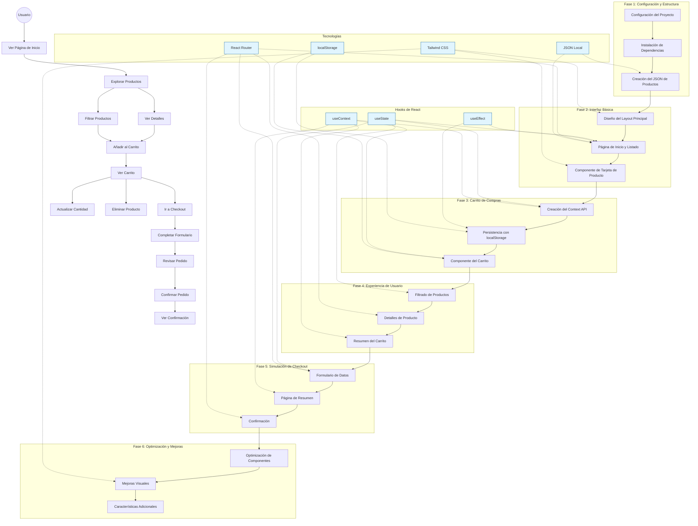

```mermaid
flowchart TD
    %% Fases principales del proyecto
    subgraph "Fase 1: Configuración y Estructura"
        A1[Configuración del Proyecto] --> A2[Instalación de Dependencias]
        A2 --> A3[Creación del JSON de Productos]
    end
    
    subgraph "Fase 2: Interfaz Básica"
        B1[Diseño del Layout Principal] --> B2[Página de Inicio y Listado]
        B2 --> B3[Componente de Tarjeta de Producto]
    end
    
    subgraph "Fase 3: Carrito de Compras"
        C1[Creación del Context API] --> C2[Persistencia con localStorage]
        C2 --> C3[Componente del Carrito]
    end
    
    subgraph "Fase 4: Experiencia de Usuario"
        D1[Filtrado de Productos] --> D2[Detalles de Producto]
        D2 --> D3[Resumen del Carrito]
    end
    
    subgraph "Fase 5: Simulación de Checkout"
        E1[Formulario de Datos] --> E2[Página de Resumen]
        E2 --> E3[Confirmación]
    end
    
    subgraph "Fase 6: Optimización y Mejoras"
        F1[Optimización de Componentes] --> F2[Mejoras Visuales]
        F2 --> F3[Características Adicionales]
    end
    
    %% Conexiones entre fases
    A3 --> B1
    B3 --> C1
    C3 --> D1
    D3 --> E1
    E3 --> F1
    
    %% Hooks y tecnologías aplicadas
    subgraph "Hooks de React"
        useState[useState]
        useEffect[useEffect]
        useContext[useContext]
    end
    
    subgraph "Tecnologías"
        tailwind[Tailwind CSS]
        router[React Router]
        localStorage[localStorage]
        json[JSON Local]
    end
    
    %% Relaciones de hooks con tareas
    useState -.-> B2
    useState -.-> C1
    useState -.-> D1
    useState -.-> E1
    
    useEffect -.-> B2
    useEffect -.-> C2
    
    useContext -.-> C1
    useContext -.-> C3
    useContext -.-> D3
    useContext -.-> E2
    
    %% Relaciones de tecnologías con tareas
    tailwind -.-> B1
    tailwind -.-> B3
    tailwind -.-> F2
    
    router -.-> B2
    router -.-> D2
    router -.-> E1
    router -.-> E3
    
    localStorage -.-> C2
    localStorage -.-> C3
    
    json -.-> A3
    json -.-> B2
    
    %% Flujo de usuario simplificado
    User((Usuario)) --> Home[Ver Página de Inicio]
    Home --> BrowseProducts[Explorar Productos]
    BrowseProducts --> FilterProducts[Filtrar Productos]
    BrowseProducts --> ViewDetails[Ver Detalles]
    ViewDetails --> AddToCart[Añadir al Carrito]
    FilterProducts --> AddToCart
    AddToCart --> ViewCart[Ver Carrito]
    ViewCart --> UpdateQuantity[Actualizar Cantidad]
    ViewCart --> RemoveItem[Eliminar Producto]
    ViewCart --> Checkout[Ir a Checkout]
    Checkout --> FillForm[Completar Formulario]
    FillForm --> ReviewOrder[Revisar Pedido]
    ReviewOrder --> ConfirmOrder[Confirmar Pedido]
    ConfirmOrder --> ConfirmationPage[Ver Confirmación]
    
    %% Conceptos de aprendizaje
    classDef learning fill:#e1f5fe,stroke:#01579b
    class useState,useEffect,useContext,tailwind,router,localStorage,json learning

```
